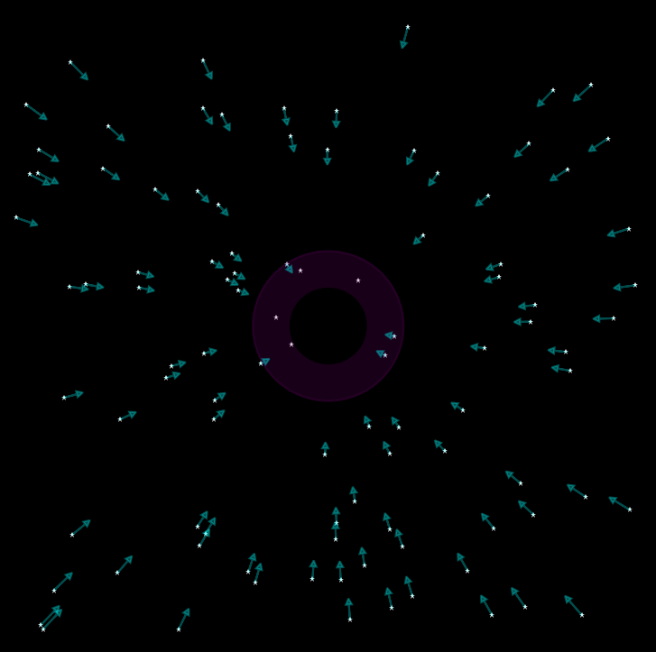

# 🌀 Black Hole Gravity Simulation

Simulação visual e interativa de um buraco negro que atrai estrelas ao seu redor. Desenvolvido com HTML, CSS e JavaScript puro, o projeto cria um efeito de gravidade central em que objetos se movem em direção ao centro da tela, como se estivessem sendo puxados por um buraco negro.

---

## 📸 Preview



---

## ✨ Descrição para LinkedIn

💻 Desenvolvi uma simulação interativa em JavaScript puro que representa o comportamento de um buraco negro atraindo estrelas próximas. O projeto combina HTML, CSS e animações em tempo real com `requestAnimationFrame` para criar uma experiência visual suave. Ideal para demonstrações de física visual e portfólios criativos. 🌌

---

## 🚀 Funcionalidades

- Geração aleatória de 100 "estrelas"
- Simulação de gravidade com movimento realista
- Interface limpa e visualmente imersiva
- Código leve e sem bibliotecas externas

---

## 🛠️ Tecnologias Utilizadas

- HTML5
- CSS3
- JavaScript puro

---

## 📂 Estrutura do Projeto

black-hole-gravity-simulation/
├── index.html
├── preview.png
└── README.md


---

## ▶️ Como Usar

1. Clone o repositório:
   ```bash
   git clone https://github.com/seu-usuario/black-hole-gravity-simulation.git

    Abra o arquivo index.html no seu navegador.

    Observe a simulação em tempo real do buraco negro puxando as estrelas.